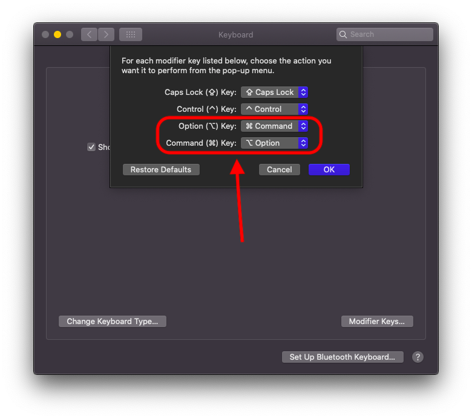
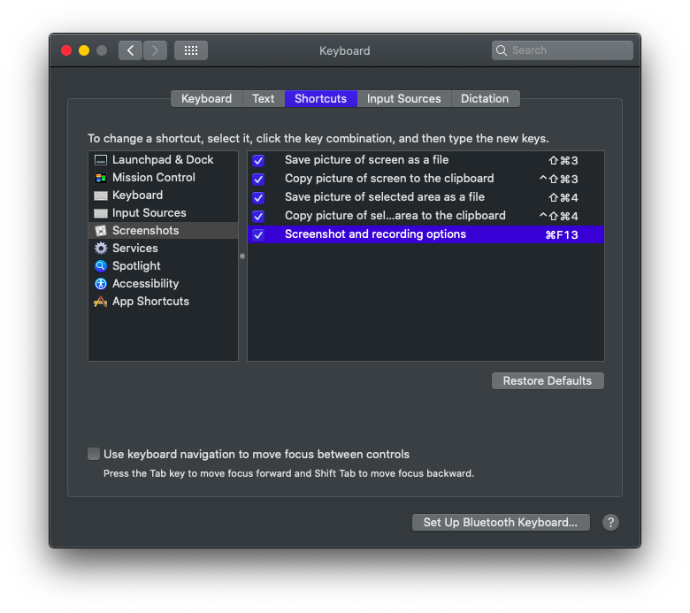

# Lenovo IdeaPad 320-14IKB (80XK) Hackitnosh 

A guide for installing macOS Catalina on Lenovo IdeaPad 320-14IKB (Kaby Lake-U).

# Note 
I'm not an expert in hackintoshing, this is my first Hackintosh, I managed to get everything working in my laptop, Your laptop may be different than mine, higher specs, dedicated GPU, etc..., if it's so this guide may not work for you, so be careful and good luck!

# Laptop's Hardware 
- <b>CPU</b>: Intel i5 7200U Dual Core CPU (Kaby Lake-U)
- <b>GPU</b>: Intel HD 620 Graphics 
- <b>Storage</b>: 500GB WD Blue Solid State Drive & 2 TB Seagate Mobile Hard Drive (Upgraded)
- <b>RAM</b>: 12 GB DDR4 2133MHz (Upgraded)
- <b>Screen</b>: 13.9-inch Full HD (1920 x 1080)
- <b>Trackpad</b>: ELAN (I2C)
- <b>Wi-Fi</b>: Broadcom DW1560 (BCM94352Z) Dual Band M.2 Ngff WiFi Card (Upgraded)
- <b>Ports</b>: 1 x USB-C, 2 x USB 3.0,USB 2.0 SD Card Reader, HDMI Display Port, Ethernet Port

# Overview 
This laptop is a budget laptop, by these specs, you can't do some heavy work, battery life is around 2-3 hours, It's good but not the best, if you want more you can choose higher specs, but consider that this guide may be different for your hardware.

# What's Working?
- Intel HD 620 Graphics full QE/CI 
- CPU power management 
- Battery (Cycles doesn't show properly)
- All USB ports 
- HDMI port (including HDMI Audio)
- Realtek Ethernet port 
- Realtek ALC230 Audio (including headphones jack)
- Wi-Fi & Bluetooth (including Apple services)
- Internal webcam with Facetime
- Trackpad (including gestures)
- Sleep (lid sleep and lid wake)
- Screen Brightness with hotkeys
- DRM support (iTunes Movies, Apple TV+, Amazon Prime and Netflix, and others)

# What's Not Working?
- Nothing

# Requirement 
- 8 GB USB Disk 
- macOS Catalina image downloaded from the Appstore 
- Mouse, because trackpad won't work in the installation 

# BIOS Configuration
Before doing anything, remember to update your BIOS to the latest version from [here](https://pcsupport.lenovo.com/us/en/products/laptops-and-netbooks/300-series/320-14ikb/downloads/ds121587), preparing your laptop to macOS, reboot your laptop, when the Lenovo logo's appear press <b>F2</b>, when the BIOS menu appears go to: 
- "Configuration" <b>SATA Controller Mode</b> to <b>AHCI</b>, <b>HotKey Mode</b> to <b>Enabled</b>.
- "Security" <b>Intel Platform Trust Technology</b> to <b>Disabled</b>, <b>Intel SGX</b> to <b>Disabled</b>, <b>Secure Boot</b> to <b>Disabled</b>.
- "Boot" <b>Boot Mode</b> to <b>UEFI</b>,<b>Fast Boot</b> to <b>Disabled</b>, <b>USB Boot</b> to <b>Enabled</b>.
- "Exit" <b>OS Optimized Defaults</b> to <b>Disabled</b>.

# Installation
After downloading macOS from the Appstore, format your USB drive as "Mac OS Extended (Journaled)", then open Terminal and type: `sudo /Applications/Install\ macOS\ Catalina.app/Contents/Resources/createinstallmedia --volume /Volumes/MyVolume`, and remember, `MyVolume` is for the name of your USB drive, you can change it if you would, mount the EFI partition in your USB, Copy-and-paste the folder `EFI` from this release's repository, download Clover Configurator from [here](https://mackie100projects.altervista.org/clover-configurator/), Then change the SMBIOS to MacBookPro14,1 which is the closest one to this laptop's hardware, update your kexts and Clover Bootloader (if available), reboot your laptop and press `F12` to enter `BIOS Menu`, choose your USB installer and boot from it, you should see the `Clover Boot Menu`, boot from the USB that shown, it may take some time to boot, after is done, you should see `macOS Utilities`, choose `Disk Utility` and erase the drive you want to install macOS on it, click on `Erase` and type the name that you want, like: "Macintosh HD", choose the format as `APFS` and `Scheme` as `GUID Partition Map` and click `Erase`, after it's done, close the window and go back to `macOS Utilities` and choose `Install macOS`, click `Agree` to accept the license agreement, the installation should starts now, your laptop should restarts several times, after it's done, login to your AppleID (for more specific guide please go [here](https://hackintosh.gitbook.io/-r-hackintosh-vanilla-desktop-guide/)), after setting up your laptop, open "Terminal" and type:
`sudo pmset -a hibernatemode 0`
`sudo rm /var/vm/sleepimage`
`sudo mkdir /var/vm/sleepimage`
This is gonna fix sleep for your laptop, unzip the folder `ALCPlugFix` and run `install.command`, type your password, this is gonna fix the static noise from your headphone after sleep, install Sniki's CodecCommander kext which can be found [here](https://github.com/Sniki/EAPD-Codec-Commander) to `/Library/Extensions` by running:
`sudo spctl --master-disable`
`sudo mount -uw`
`sudo killall Finder`
`sudo cp -R CodecCommander.kext /Library/Extensions`
`sudo chown -v -R root:wheel /System/Library/Extensions`
`sudo touch /System/Library/Extensions`
`sudo chmod -v -R 755 /Library/Extensions`
`sudo chown -v -R root:wheel /Library/Extensions`
`sudo touch /Library/Extensions`
`sudo kextcache -i /`
Restart, and you're ready to go!

# Extras
- After you finished the installation you'll notice that your iMessage and other Apple services arent working! to fix that issue you have to add 'ROM', 'MLB' and a proper SMBIOS (which is MacBookPro14,1 for this device) in your 'config.plist', for more informaiton follow this guide from [here](https://www.tonymacx86.com/threads/an-idiots-guide-to-imessage.196827/).
- If you don't like the name of your laptop that shown in "About This Mac", you can change it! Press Shift+Cmd+G (⇧⌘G) and copy-and-paste this path: `/Users/Username/Library/Preferences/com.apple.SystemProfiler.plist`, and remember, The word `Username` Is for your username, now download your favorite plist editor (mine is "PilstEdit Pro"), then you can change to `Lenovo IdeaPad 320-14IKB (80XK)` or any name you want.

- VoodooPS2Contoller recognize `Alt` key as `Command` and `Win` key as `Option` for some-reaason, if you want to fix this issue use `SSDT-Swap-Cmd-Alt` in the ACPI folder, also, the key "PrtSc" can be remapped from disabling trackpad to take screenshots and record videos, use `SSDT-PrtSC-F13` for remapping it to "F13",but if you want to use both of them, use `SSDT-PS2K`, if you don't want anything to change, you can delete it.

- Who needs CDs these days? You can buy this caddy and replace it with the CD Drive from [here](https://www.aliexpress.com/item/32850001303.html) to get dual drives.
- 4 GB of ram isn't enough these days, Unfortunately, 4 GB is built-in the motherboard, so the maximum is 12 GB, you can upgrade your RAM to 12 GB total from [here](https://www.amazon.com/Corsair-Module-2133MHz-Unbuffered-SODIMM/dp/B0143UM6Y0/ref=sr_1_6?dchild=1&keywords=8+ram+2133&qid=1585516185&s=electronics&sr=1-6).
- The Wi-Fi card that shipped with this laptop is Intel Wi-Fi card, there's a kext for it under development which can be found [here](https://github.com/AppleIntelWifi/adapter), but for now, you can buy the BCM94360CS2, an Apple wifi card for this laptop for less than 40$ (USD), nowadays , The DW1560 is quite expensive and it's not from Apple, fortunately, I bought it before it becomes, if you want to buy it instead of the DW1560, You can delete all Wi-Fi and Bluetooth kexts from the EFI folder because it's natively supported in macOS, [The Wi-Fi Card](https://www.aliexpress.com/item/32637520988.html?trace=wwwdetail2mobilesitedetail&spm=a2g0s.9042311.0.0.5e204c4dWDlWnx), [The Adapter](https://www.aliexpress.com/item/4000300306817.html?trace=wwwdetail2mobilesitedetail&trace=wwwdetail2mobilesitedetail&spm=a2g0s.9042311.0.0.5e204c4dWDlWnx), [The Antennas](https://www.aliexpress.com/item/32862630916.html?trace=wwwdetail2mobilesitedetail&spm=a2g0s.9042311.0.0.5e204c4dWDlWnx).
- You can change the frequency of your CPU in 'config.plist' as shown in the photo, without changing it, macOS will recognize it as 2.71 GHz for some-reason. 

- You can change the name of your graphics like this, I chose the name `Intel HD Graphics 620 macOS Edition` you can choose whatever you want as shown in the photo.

- You can make your laptop boots automatic to macOS if you don't have another OS installed as shown in the photos, type your drive's name, check `Fast` and check `Auto=Yes`, now your laptop should boot automatically to macOS without the `Clover Boot Menu`.

- If you want to get these option to choose the resolution like this you can! by running this command which can be found [here](https://github.com/xzhih/one-key-hidpi), type your password and choose the numbers 1,3,1 then restart.

- If you don't like the deafult Clover you can change it! Search the web and choose your favorite theme, copy-and-paste it to 'themes' in 'EFI' folder, then go to your 'config.plist', 'GUI' section, 'Theme' and type the name of your theme, you can use 'Clover OSS Theme', which looks like a real Mac boot-up screen. 

# Credits
- [Apple](https://www.apple.com) for macOS.
- [Acidanthera](https://github.com/acidanthera) for most of the kexts.
- [goodwin](https://github.com/goodwin) for ALCPlugFix.
- [RehabMan](https://github.com/RehabMan) for some patches.
- [Sniki](https://github.com/Sniki) for some patches.
- [daliansky](https://github.com/daliansky) for some patches.
- [Moh_Ameen](https://github.com/ameenjuz) for some patches.
- [al3xtjames](https://github.com/al3xtjames) for clover-theme-oss theme.
- [ImmersiveX](https://github.com/ImmersiveX) for clover-theme-minimal-dark theme.
- And anyone else that helped to develop and improve hackintoshing.
